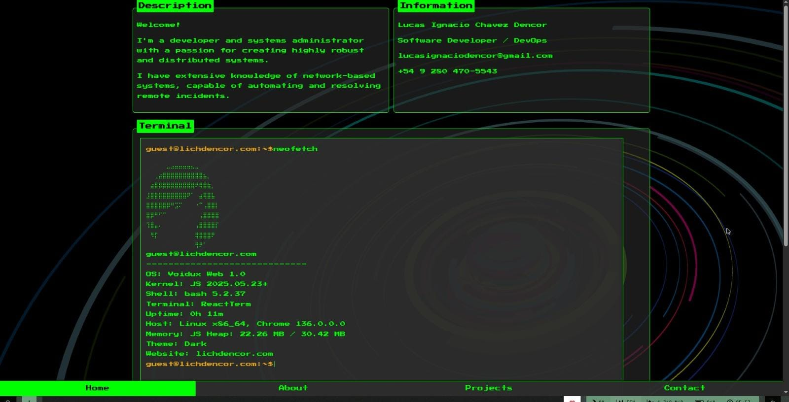

# TUI-Portfolio

A reborn web portfolio with a TUI (Text User Interface) aesthetic.  
Now featuring a built-in terminal that simulates POSIX commands in Bash.



## Features

- Simulated Bash-style terminal with basic POSIX-like commands (`ls`, `cat`, `echo`, `grep`, `rm`, `touch`)
- Simulated `neofetch` with host OS (browser), JS heap, and page uptime (resets on refresh)
- Retro TUI-inspired UI, styled per page and component
- Modular project and configuration context shells  
  _(e.g., `info-shell` is custom; you could implement others like `conmmanctl`, `python`, etc.)_

## Live Demo

Check it out live here: [https://lichdencor.netlify.app](https://lichdencor.netlify.app)

## Getting Started

### Requirements

- [Bun](https://bun.sh/) installed globally (bun --version)

### Run Locally

1. **Clone the repo**

   ```bash
   git clone https://github.com/lichdencor/TUI-Portfolio.git
   cd TUI-Portfolio
   ```

2. **Install the dependencies**

   ```bash
   bun install
   ```

3. **Start develeopment server**

   ```bash
   bun run dev

```
4. Visit  http://localhost:PORT (e.g., port 5173, 3000, etc.)
```

## License

This project is licensed under the [MIT License](./LICENSE).  
You are free to use, modify, and distribute this project — just make sure to credit the original author.
